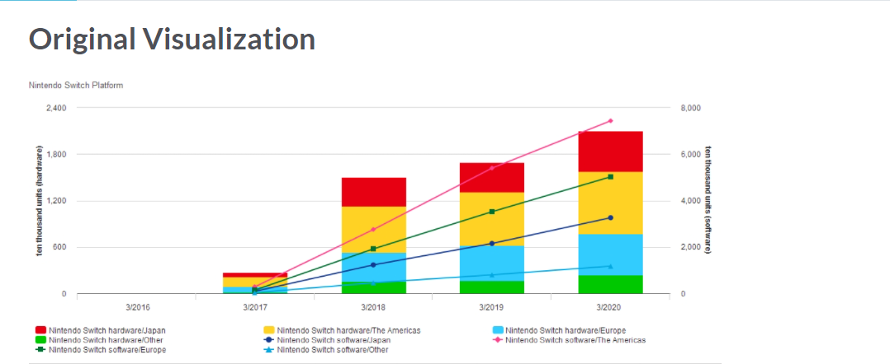
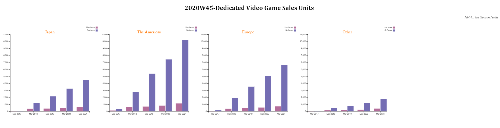

# MakeoverMonday challenge

This is 2020 week 45 challenge posted on [MakeoverMonday](https://www.makeovermonday.co.uk/data/data-sets-2020/) website.

Link to the challenge and data source: [Chart challenge](https://data.world/makeovermonday/2020w45-dedicated-video-game-sales-units)

_Here is the original visualization posted:_

The objective of this challenge is to make this chart better so that the insights clearly stand-out.

_Here is my version of the chart:_

**Insights from the chart:**

- _The Americas_ market had high sales over the years compared to other regions
- Sales by region _The Americas_ > _Europe_ > _Japan_ > _Other_
- There has been a consistent increase both in sales of _Hardware_ and _Software_ over the years.
- _Software_ units sold are way higher than _Hardware_

_D3.js chart can be found here:_ [codepen](https://codepen.io/ksp585/full/qBrmVzv)
