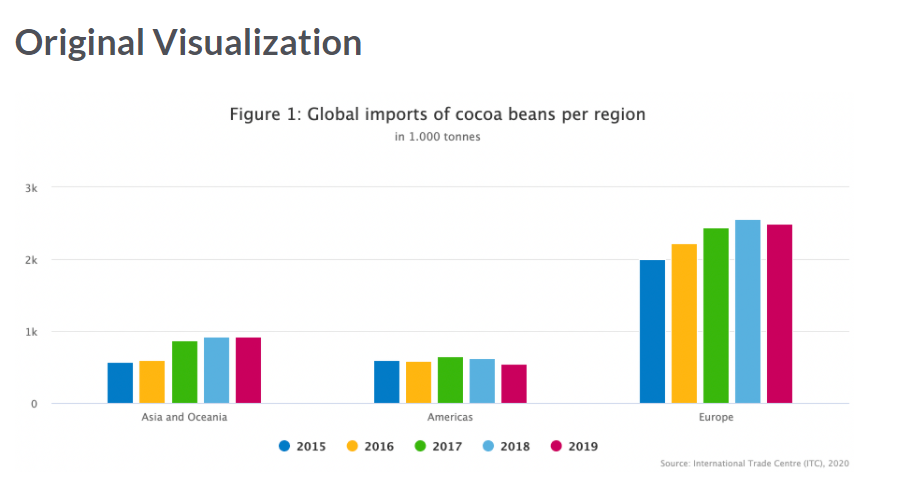
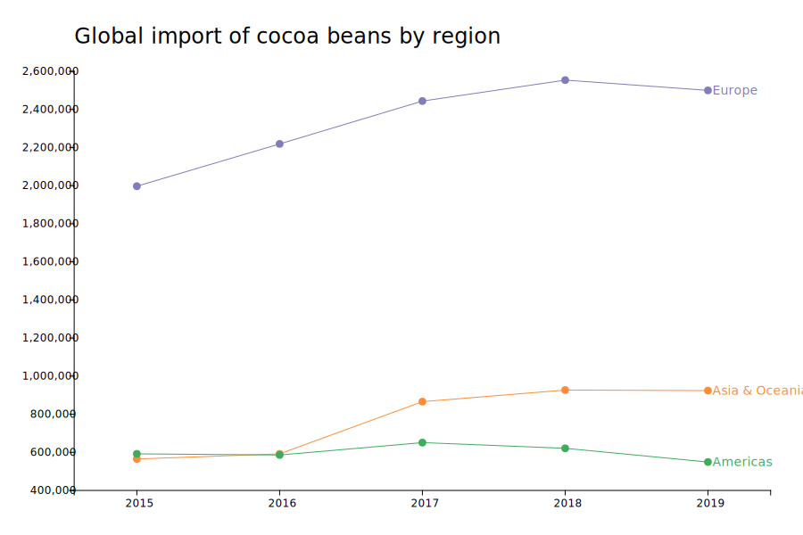

# MakeoverMonday 2020 week 52 challenge

This is 2020 week 52 challenge posted on [MakeoverMonday](https://www.makeovermonday.co.uk/data/data-sets-2020/) website.

Link to the challenge and data source: [Chart challenge](https://data.world/makeovermonday/2020w52)

**Here is the original visualization posted:**

The objective of this challenge is to make this chart better so that the insights clearly stand-out.

**Here is what I came up with:**

This prototype was created using [Charticulator]("https://charticulator.com/) which is an opensource data viz tool for creating custom data visualizations.

For these projects, I prototype in _Charticulator_ and then I build the chart in _D3.js_.

**D3.js chart can be found here:** [codepen]("https://codepen.io/ksp585/full/qBraEdj")
